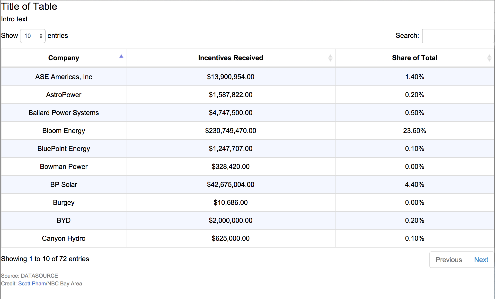

##Create a Searchable Table With a Google Spreadsheet

This is an open-sourced template that creates boostrap-styled DataTables using the very cool [tabletop library](https://github.com/jsoma/tabletop) and the [datatables jquery plugin](http://datatables.net/).

This is actually an update of [Chris Essig](https://twitter.com/CourierEssig) and [Chris Keller](https://twitter.com/ChrisLKeller)'s super useful [datafeed_to_datatables](https://github.com/chrislkeller/projects.chrislkeller.com/tree/master/demos/datafeed_to_datatables) repo. I've used and enjoyed it quite a bit, but I wanted to use the latest version of DataTables which has a more readable API and what seems to be better built-in sorting algorithms. 

This version should hopefully be a little easier to extend and customize using the [DataTables options](http://datatables.net/reference/option/).
[Click for a live demo](http://scottpham.github.io/tabletop-to-datatables/)
